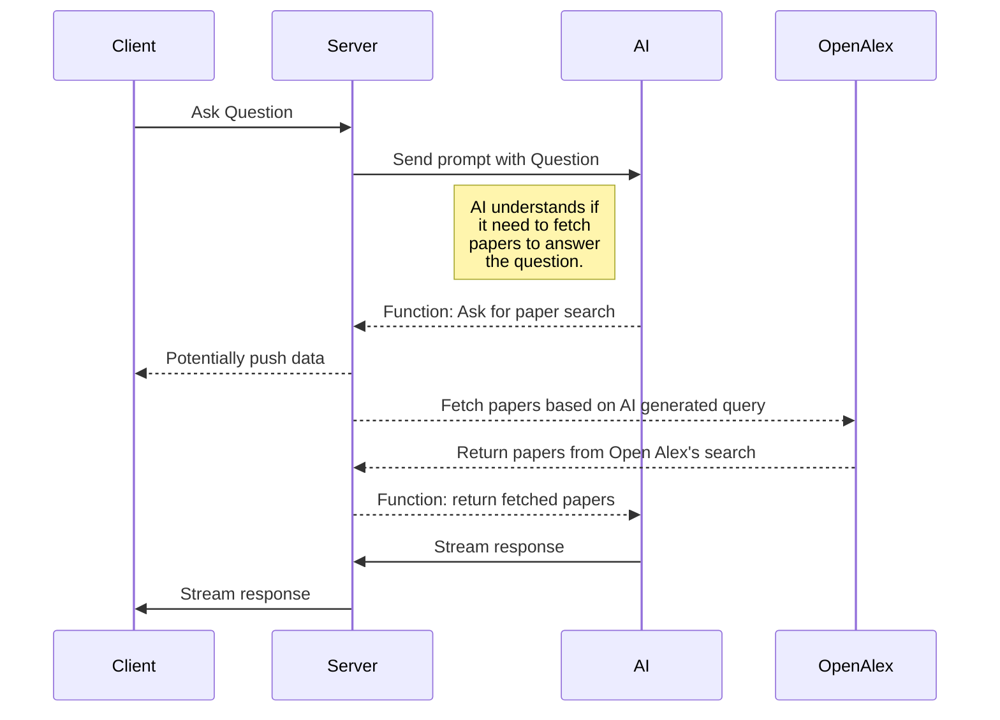

# proem

## Vercel link, neon DB & local workflow

Vercel's Neon integration builds a new branch of the database for each new branch in git.
Currently `apps/proem` is the only Vercel project configure with the [https://vercel.com/integrations/neon](Neon Postgres Ingtegration).
New connections strings is then added in Vercel and can be pulled local as follows:

1. Initially link you the mono repo with vercel: `vercel link --repo`.
2. Every time you change branch the updated env vars can be fetched with: `pnpm run vercel-pull-env`.
   (TODO!: this can be automated or simplified at a later point of deemed tedious)

### Git branches and corelating DB's

| Git branch name | Database name locally   | Database name on Vercel |
| --------------- | ----------------------- | ----------------------- |
| main            | main (production)       | vercel-dev (preview)    |
| [branch_name]   | [branch_name] (preview) | [branch_name] (preview) |

Because Vercel only have custom branches for the preview enviroment and the Neon integrations relies on that, we're currently running the exact same environment variables for both preview environment on Vercel & local development.
Note: Right after installing the integration the `DATABASE_URL` & `PGHOST` env vars is only set to "Development"."Preview" has been added manually.

## Answer Engine AI streaming

